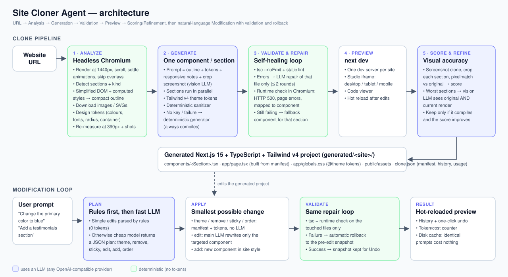

# Site Cloner Agent
https://site-cloner-agent.onrender.com
An AI agent that takes a public website URL, analyzes the rendered page, and generates a **new** responsive
**Next.js 15 + TypeScript + Tailwind CSS v4** frontend that recreates it. The agent validates and repairs its own
code, runs a local preview, scores visual accuracy against the original, and then edits the site from
natural-language instructions such as *"Change the primary color to blue"* or *"Add a testimonials section"*.

Nothing is hardcoded to a particular website, and the output is real component code, not an embedded copy.



## Setup

Requirements: Node.js 20.11+ and an API key for any OpenAI-compatible LLM provider (Groq has a free tier).

```bash
npm run setup                # npm install + download headless Chromium for Playwright
cp .env.example .env         # then set LLM_API_KEY (and optionally the models)
npm start                    # studio at http://localhost:4000
```

In the studio: paste a URL and press **Clone**. You can watch the pipeline run, then switch the preview between
Desktop, Tablet and Mobile, compare the original with the clone, read the generated code, and type modification
prompts (with **Undo**).

The same agent also runs from the terminal:

```bash
npm run clone -- https://example.com --keep                 # --keep leaves the preview server running
npm run modify -- <site-slug> "Make the navbar sticky" --keep
npm test                                                    # unit tests
```

Generated projects are written to `generated/<site-slug>/` and are standalone Next.js apps
(`npm install && npm run dev` works inside them).

Without `LLM_API_KEY` the agent still runs end to end in **offline mode**. It uses a deterministic generator and
rule-based edits, which is useful for trying the pipeline, but the AI path gives far better fidelity.

## Architecture

| Stage | What happens | Code |
|---|---|---|
| 1. Analyze | Playwright renders the page at 1440px. It scrolls to trigger lazy content, jumps animations to their end state and ignores cookie banners and modals. A script running in the page finds the sections, labels each one (navbar, hero, pricing and so on), and captures a simplified DOM with only the computed styles that matter visually. It also downloads images and SVGs, derives design tokens (colours, fonts, radius, container width), and re-measures the layout at 390px to learn the responsive behaviour. | `agent/analyze.ts`, `agent/browser/*.js`, `agent/colors.ts` |
| 2. Generate | Each section is sent to the model with a compact outline of its structure, the design tokens, responsive notes and a cropped screenshot. The model writes one React component per section, and sections run in parallel. The output passes through a deterministic sanitizer before anything else. | `agent/generate.ts`, `agent/outline.ts`, `agent/prompts.ts` |
| 3. Validate and repair | The agent runs `tsc --noEmit` plus static checks. Each failing file goes back to the model with its compiler errors, for up to 2 rounds. A runtime check in Chromium catches server-render errors and uncaught exceptions and maps them to the component that caused them. Anything still broken is replaced by the deterministic generator's version, so a clone never ends in a broken build. | `agent/pipeline.ts`, `agent/validate.ts` |
| 4. Preview | `next dev` runs for the generated site, shown in the studio iframe at desktop, tablet and mobile widths. | `agent/preview.ts`, `studio/` |
| 5. Score and refine | The agent screenshots the clone, crops every section and compares it with the original using a blurred pixelmatch plus a height match, giving a 0–100% score. For the worst sections, the vision model sees the original and the current render side by side and fixes the differences. A refinement is kept only if it compiles and scores higher. | `agent/compare.ts` |
| Modify | A planner turns the prompt into a JSON plan with theme, remove, sticky, edit, add and order operations. Theme, remove, sticky and order changes are applied to the manifest and tokens without an LLM call. Edit and add operations regenerate only the affected components. The result is validated, a failure rolls back automatically, and every successful change is snapshotted for Undo. | `agent/modify.ts` |

## Technologies and models

- **Agent:** TypeScript on Node.js (tsx), Express, and Server-Sent Events for live progress.
- **Browser automation:** Playwright with Chromium; `sharp` and `pixelmatch` for screenshots and scoring.
- **Generated sites:** Next.js 15 (App Router), React 19, TypeScript, Tailwind CSS v4 and `lucide-react` icons.
- **LLM:** any OpenAI-compatible Chat Completions API, configured in `.env`. The defaults are Groq, with
  `qwen/qwen3.8-27b` (vision) as the main model and `openai/gpt-oss-20b` as the fast planning model. OpenAI, Anthropic, Gemini
  and OpenRouter work by changing `LLM_BASE_URL` and the model names.

## Key implementation decisions

- **Analyze the rendered page, not the HTML source.** Modern sites are client-rendered, so the agent reads computed
  styles and real geometry from Chromium. Sending raw HTML to a model would be expensive and misleading.
- **Compact outline instead of HTML.** Each section becomes an indented outline, for example
  `a "Get started" [bg:primary color:#fff radius:8 pad:12 20 12 20 16px 600]`. This keeps what affects the visuals and
  costs a fraction of the tokens.
- **Section-by-section generation.** Prompts stay small, so they're cheap and less likely to hallucinate. Errors are
  isolated to one file, sections run in parallel, and the output is naturally a set of reusable components.
- **Design tokens as Tailwind theme variables.** Colours, fonts and radius live in `app/globals.css` (`@theme`) and the
  components use classes like `bg-primary`. A prompt like "change the primary colour to blue" is then a one-line token
  change instead of a rewrite.
- **The page is built from a manifest.** `app/page.tsx` is regenerated from `clone.json`, so adding, removing,
  reordering or making a section sticky never needs a model call.
- **Deterministic safety net.** A rule-based DOM-to-React generator always produces compilable code. It runs the
  offline mode and replaces any component the model can't fix.
- **Measure, don't guess.** Visual similarity is computed per section, and refinement only keeps changes that measurably
  improve the score.

## Error handling

- **Rate limits and outages:** the agent retries on HTTP 429 and 5xx responses with backoff, honouring `retry-after`.
- **Code errors:** model output is sanitized (for example, `next/image` becomes `` and `"use client"` is added when
  hooks are used). The agent then type-checks, runs the repair loop and the runtime check, and falls back
  per component when repairs fail.
- **Edits:** every modification is snapshotted and rolled back automatically if it fails to compile or render.
- **Unreachable sites:** bot-protection pages, timeouts and HTTP errors produce a clear message instead of a crash.

## Cost awareness

- One compact outline per section and downscaled JPEG crops keep prompts small.
- A cheap fast model does the planning, and the rule-based planner handles simple edits with zero tokens.
- Theme, remove, sticky and reorder edits are applied without any LLM call.
- Repairs send only the failing file and its errors. Refinement is limited to the worst `REFINE_MAX_SECTIONS` sections.
- A disk cache (`.cache/llm`) makes re-running identical prompts free.
- The studio and `clone.json` show calls, tokens and estimated cost. Set `LLM_PRICE_IN` and `LLM_PRICE_OUT` to your model's prices.

## Limitations

- The agent recreates the landing page at the given URL, not the site's other routes. Links to the same site point to `#`.
- Canvas, WebGL, video and iframe content becomes placeholders. Complex scroll animations aren't reproduced.
- Proprietary self-hosted fonts fall back to the closest Google Font of the same name, or to the system font.
- Sites behind bot protection (Cloudflare challenges) or a login can't be analyzed.
- Very long pages are capped at `MAX_SECTIONS`, and extra content is merged into the last section.
- The similarity score is a coarse perceptual metric meant for comparing sections, not a pixel-perfect measure.
- Accuracy depends on the model. Vision-capable models do noticeably better on complex layouts.

## Project structure

```
agent/
  analyze.ts        Playwright capture, assets, tokens         browser/extract.js  in-page DOM/style extraction
  outline.ts        compact outline for prompts                browser/mobile.js   390px responsive measurements
  generate.ts       LLM generation, sanitizer, repair, refine  fallback.ts         deterministic DOM → React generator
  validate.ts       tsc, runtime check, next build             compare.ts          screenshot scoring
  pipeline.ts       clone pipeline + repair loops              modify.ts           NL planner, edits, undo/rollback
  scaffold.ts       Next.js project files from the manifest    llm.ts              OpenAI-compatible client, cache, cost
  server.ts / cli.ts  studio API (REST + SSE) / terminal       prompts.ts          all prompts
studio/             single-page studio UI (no build step)
tests/              unit tests (node:test)
docs/architecture.svg
```
